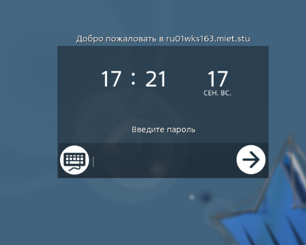
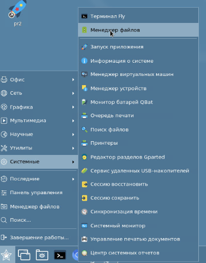
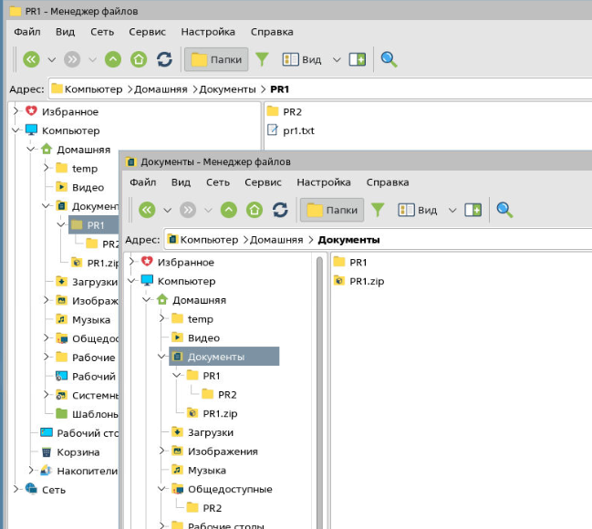

## Task 1. Включение/выключение машины, повторный вход и переключение сессий.
  - **Войдите в систему. Выключить компьютер. Вклчить компьютер. Повторно войти.**
    - 

  - **Выполните блокировку сессии, войдите в систему.**
    - 

  - **Запланируйте перезагрузку системы через 1 минуту.**
    - 
    - 

## Task 2. Рабочий стол (запуск приложений, управление элементами)
  - **Запустите последовательно приложения.**
    - Веб-браузер Firefox, Помощь:
      - 
    - Редактор Kate, Просмотр изображений Gwenview, Калькулятор:
      - 

  - **Осуществите переключение между активными окнами приложений (панель задач, окна, alt + tab).**
  - **Переместите активные окна приложений на рабочие столы 1-4: (констекстное меню панели, окон, перетаскивание):**
    - 
    - 

  - **Закройте все запущенные ранее приложения (Кнопка окна, контекстное меню):**
    - 

  - **Создайте на рабочем столе ярлык приложения «Калькулятор».**
    - 

  - **Создайте на панели запуска кнопку для запуска веб-браузера Chromium:**
    - 

## Task 3. Менеджер файлов (просмотр файлов и папок, файловые операции)
  - **Запустите «Менеджер файлов» 4-мя способами:**
    - 
    - 
    - Иконка `"Мой компьютер"` -> раздел `"Домашняя"`

  - **Откройте каталог «Файловая система».**
  - **Найдите домашний каталог пользователя, проверьте содержимое папок в домашнем каталоге.**
    - 

  - **В каталоге «Документы» создайте папку «ПР1».**
  - **В папке «ПР1» создайте файл Пр1.txt.**
  - **Откройте файл Пр1.txt в текстовом редакторе, внесите несколько строк произвольного текста и закройте файл.**
  - **В каталоге «Общедоступные» создайте папку «ПР2». Создайте текстовый файл Пр2.txt, повторив действия.**
    - 

  - **Создайте на рабочем столе ярлык файла Пр2.txt (проверьте работоспособность).**
    - 

  - **Скопируйте папку ПР2 в папку ПР1.**
  - **Папку ПР1 упакуйте в архив ZIР.**
    - 

## Task 4. Менеджер файлов (просмотр файлов и папок, файловые операции)
  - **Нажмите на крайнюю правую кнопку области уведомлений, будут свернуты все окна запущенных приложений, повторное нажатие приведет к разворачиванию всех окон. (подсвечена)**
    - 

  - **Нажмите на значок в области уведомлений, чтобы вызвать приложение `«Дата и время»`. Откройте вкладку «Формат отображения». Путем выбора предложенных вариантов, настройте наиболее удобный вид отображения даты и времени в панели уведомлений.**
  - **Для изменения языка раскладки клавиатуры нажмите значок уведомлений. С помощью `ПКМ` -> `"Свойства"` откройте окно программы `«Раскладка клавиатуры»`, в которой можно добавить языки раскладки и настроить `«Горячие клавиши»` ввода.**
    - 

  - **На индикаторе сети с помощью `ПКМ` -> `"Сведения о соединении"` вызовите графическое окно сведений о текущем соединении, запишите эти сведения.**
    - 

  - **Наведите курсор на индикатор громкости и убедитесь, что стало доступным управление громкостью звука компьютера. Измените уровень громкости.**
  - **Отключите звук уведомлений, используя меню индикатора громкости.**
    - 

## Task 5. Пользовательские настройки: панель управления
  - **Настройте сглаживание шрифтов: для ЖК-мониторов, уточнение среднее.**
    - 

  - **Назначьте комбинацию клавиш на включение/выключение отображения панели задач.**
    - 

  - **Создайте в панели меню «Пуск» новую категорию «Часто используемое». Задайте положение категории в самом верху списка.**
  - **Соберите в категории «Часто используемое» ярлыки приложений:**
    - Редактор Kate;
    - Простой редактор изображений KolourPaint;
    - Терминал Fly

  - **Настройте внешний вид рабочего стола и графических окон в стиле Windows.**
    - 

  - **Настройте параметры блокировки экрана:**
    - запретите переход на другую консоль или сессию;
    - запретите подключение программ из сети.
    - 
